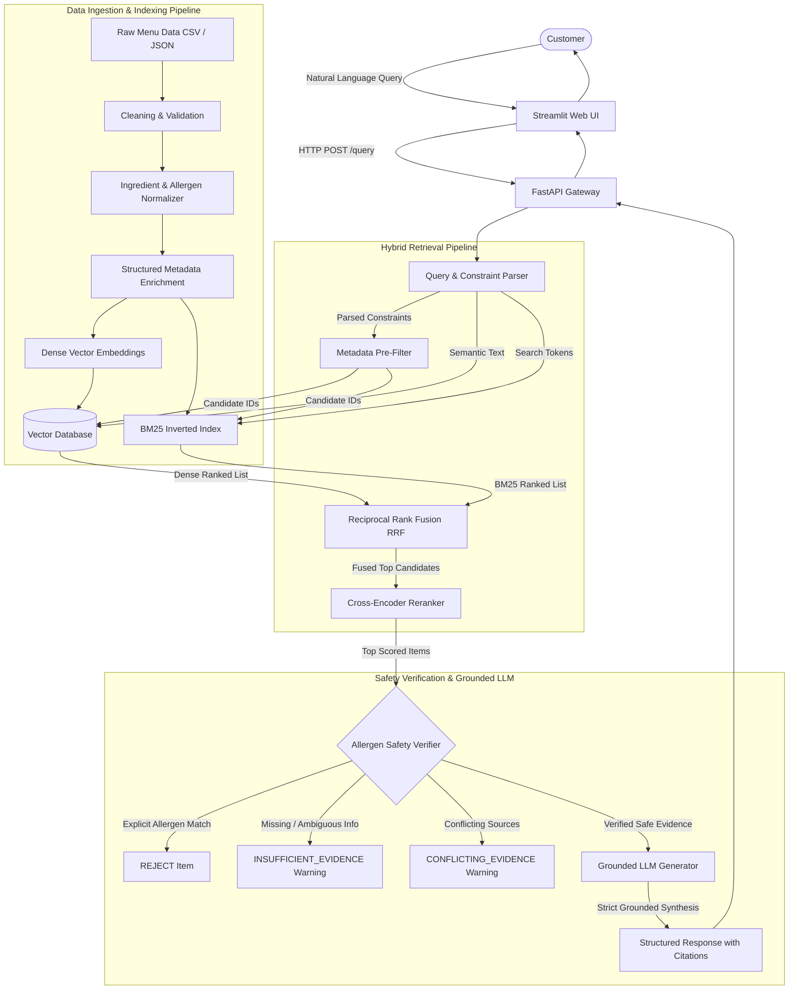
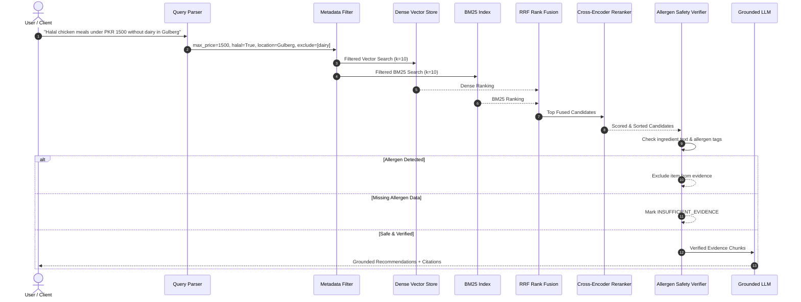

# Architecture Specification

## Dynamic Food Delivery Menu & Allergen RAG

---

## 1. System Architecture Overview

The system is engineered as a decoupled, multi-stage retrieval and safety pipeline. In food allergy applications, standard vector proximity search is not reliable on its own; hence, safety verification is segregated into an independent, deterministic stage that runs before grounded LLM generation.



---

## 2. Ingestion & Indexing Pipeline

1. **Raw Menu Ingestion**: Menu records from digital restaurant feeds (e.g., Foodpanda PK format, cloud kitchens) containing ingredients, prices, location, Halal status, and spice levels.
2. **Data Cleaning & Type Coercion**: Ensure IDs are unique, prices are non-negative numeric floats, boolean flags (`halal`, `availability`) are strictly evaluated, and empty strings are converted to explicit nulls.
3. **Allergen Standardization**:
   - Normalizes synonyms: `cow milk`, `butter`, `desi ghee`, `cream` $\rightarrow$ `dairy`.
   - Normalizes: `groundnut`, `peanut butter` $\rightarrow$ `peanuts`.
   - Normalizes: `maida`, `atta`, `wheat flour` $\rightarrow$ `gluten`.
   - Normalizes: `prawn`, `shrimp`, `crab` $\rightarrow$ `shellfish`.
4. **Dual Index Generation**:
   - **Dense Vectors**: Semantic composite strings (`[Category] Dish Name - Description. Ingredients: ...`) embedded using Sentence-Transformers (e.g. `all-MiniLM-L6-v2`) or OpenAI embeddings.
   - **BM25 Token Inverted Index**: Exact keyword tokens indexed across dish names, ingredients, and categories to capture rare terms (e.g. `shinwari`, `karahi`, `chana`).

---

## 3. Online Hybrid Retrieval & RRF

To optimize both semantic recall and exact keyword precision, the system executes **Hybrid Retrieval**:



### Reciprocal Rank Fusion (RRF) Formula
$$RRF\_Score(d) = \sum_{m \in \{Dense, BM25\}} \frac{1}{k + r_m(d)}$$
Where $r_m(d)$ is the 1-based rank position in retrieval modality $m$, and $k$ is the smoothing constant (default: 60).

---

## 4. Allergen Safety Verification Logic

The Allergen Safety Verifier enforces four definitive states:
1. **MATCH / REJECT**:
   - The dish has the excluded allergen in its `allergens` list, OR
   - The dish ingredients string contains exact allergen keywords or known derivatives (e.g. `ghee` or `cream` when `dairy` is excluded).
2. **VERIFIED_PASS**:
   - The dish `allergens` list is populated and does NOT contain the excluded allergen.
   - Comprehensive ingredient scan reveals zero matching allergen triggers.
3. **INSUFFICIENT_EVIDENCE**:
   - Allergen information is missing (`null`, empty, or explicitly tagged as `unknown`).
   - The system NEVER assumes that an unlisted allergen means the dish is allergen-free.
4. **CONFLICTING_EVIDENCE**:
   - Discrepancy between menu source documents (e.g., standard menu vs allergen bulletin).

---

## 5. Grounded Generation Guidelines
The LLM prompt strictly requires:
- Only using items from verified evidence.
- Explicitly outputting the exact restaurant name, dish name, price in PKR, and location.
- Explaining *why* the item matches the user's constraints.
- Citing the source ID and menu reference.
- Emitting explicit user-facing warnings if any relevant items had insufficient allergen evidence.

---

## 6. Dense Vector Indexing & Semantic Retrieval (Milestone 3)

### 6.1 Embedding Model Selection
- **Default Model:** `all-MiniLM-L6-v2` (384-dimensional dense vectors).
- **Rationale for Selection:**
  1. *Optimized for Semantic Search:* Fine-tuned on over 1 billion sentence pairs for clustering and retrieval.
  2. *Low Latency & Compact Footprint:* 384 dimensions allow sub-5ms similarity search with minimal memory overhead, critical for interactive restaurant ordering.
  3. *Zero-Downtime Fallback Architecture:* Wrapped inside [`EmbeddingProvider`](file:///c:/Users/sheik/Downloads/Food%20Rag%20Application/rag/embeddings.py#L20-L40), supporting local ONNX runtime, Sentence-Transformers, OpenAI embeddings (`text-embedding-3-small`), and deterministic dense fallback.

### 6.2 Searchable Document Representation
Each menu item is converted into a structured semantic document text:
```
Restaurant: {restaurant_name} | Dish: {dish_name} | Description: {description} | Ingredients: {ingredients} | Category: {category} | Cuisine: {cuisine} | Spice Level: {spice_level} | Location: {location}
```
*Design Constraint:* Safety claims (e.g. "safe", "peanut-free") are intentionally omitted from document text to prevent semantic confusion with non-allergen text.

### 6.3 Vector Database & Metadata Schema
- **Database Engine:** ChromaDB Persistent Client (`chromadb.PersistentClient`).
- **Distance Metric:** Cosine similarity ($HNSW$ space: `cosine`).
- **Metadata Fields:** Stored as primitive types for fast pre-filtering:
  - `id`: Unique dish string
  - `restaurant_name`, `dish_name`: Strings
  - `price_pkr`: Float
  - `location`: Canonical city zone
  - `halal`: Boolean indicator
  - `spice_level`: Canonical spice tier
  - `allergens_json`: Serialized JSON array of normalized allergens
  - `allergen_status`: `KNOWN_ALLERGENS` | `KNOWN_NO_ALLERGENS` | `UNKNOWN` | `CONFLICT`
  - `category`, `cuisine`, `source`, `source_url`: Categorical strings

### 6.4 Batch Processing & Idempotency
- Indexed in batches (default: 16 items) to prevent memory bottlenecks.
- Document IDs are deterministic (`dish_001` ... `dish_035`).
- Uses `upsert()` to guarantee idempotency; re-indexing does not generate duplicate records.

### 6.5 Known Limitations of Dense Vector Retrieval Alone
1. *Numerical Reasoning Deficit:* Semantic embeddings cannot reliably enforce numeric boundary conditions (e.g. "under PKR 1500" may retrieve an expensive PKR 2,450 item with high text similarity).
2. *False Safety Assumptions:* Vector distance cannot distinguish "peanut chicken" from "peanut-free chicken" because both have high contextual similarity.
3. *Rare Token Blindness:* Specific culinary keywords (e.g. "Shinwari", "Besan", "Rahu") may have weak embedding representations.
*Conclusion:* These limitations validate the project's hybrid design pairing Dense Vectors with BM25 keyword search, structured metadata pre-filters, and the deterministic Allergen Safety Verifier.

---

## 7. Baseline RAG Retrieval & Grounded Generation Pipeline (Milestone 4)

### 7.1 Pipeline Flow
The baseline RAG pipeline executes the following deterministic stages:
```
User Query
    │
    ▼
Query Embedding (EmbeddingProvider)
    │
    ▼
Dense Vector Retrieval (BasicRetriever over ChromaDB top-k)
    │
    ▼
Context Construction (build_context: formatted [DOCUMENT i] blocks)
    │
    ▼
LLM Generation (BaseGenerator / MockGroundedGenerator / OpenAIGenerator)
    │
    ▼
Grounded Answer + Citations [dish_xxx] + Latency Metrics
```

### 7.2 Context Construction Contract
Retrieved documents are converted into discrete evidence blocks using [`format_single_document()`](file:///c:/Users/sheik/Downloads/Food%20Rag%20Application/rag/context_builder.py#L6-L55):
- Preserves exact restaurant name, dish name, price in PKR, location, and spice level.
- Formats verified Halal status (`Yes (Certified)`, `No (Non-Halal)`, or `Unverified / Unknown`).
- Formats normalized allergens alongside their explicit status (`[KNOWN_ALLERGENS]`, `[KNOWN_NO_ALLERGENS]`, `[UNKNOWN]`, `[CONFLICT]`).
- Appends unique Source ID (e.g., `dish_001`).

### 7.3 Grounded Generation Rules
The LLM prompt enforces:
1. Answers strictly derived from supplied context.
2. Complete prohibition of fabricated dishes, prices, ingredients, or allergens.
3. Every factual statement must cite its Source ID in brackets, e.g., `[dish_001]`.
4. Mandatory acknowledgement when evidence is insufficient or missing.

### 7.4 Baseline Limitations
- *No Hard Filter Enforcement:* Vector search alone cannot guarantee price `<= 1500` or strict allergen exclusion.
- *No Hybrid BM25 Fusion:* Lexical exact-match keywords are not yet boosted by reciprocal rank fusion.
- *No Cross-Encoder Reranker:* Semantic rankings rely solely on bi-encoder cosine distance.

---

## 8. Constraint Parsing & Deterministic Metadata Pre-Filtering (Milestone 5)

### 8.1 Hard Constraints vs. Soft Preferences
Natural language food queries intertwine strict logical boundaries with general search tastes. The architecture explicitly decouples them:
- **Hard Constraints (Must Satisfy):**
  - `max_price_pkr` / `min_price_pkr`: Mathematical upper/lower limits (e.g., "under PKR 1500").
  - `halal`: Strict boolean certification requirement (`True`).
  - `location`: Exact delivery zone (e.g., "Gulberg", "DHA", "Saddar").
  - `excluded_allergens`: Non-negotiable exclusion list (e.g., `["dairy", "peanuts"]`).
  - `availability`: Only in-stock dishes (`True`).
  Dishes violating any hard constraint are deterministically dropped before candidate scoring.
- **Soft Preferences (Semantic Guidance):**
  - `category` (e.g., "Chicken", "Biryani", "Burgers").
  - `cuisine` (e.g., "Pakistani", "Continental").
  - `spice_level` (e.g., "Spicy", "Medium", "Mild").
  - `protein_preference` (e.g., "high protein").
  Soft preferences enrich vector and semantic search but never trigger rigid exclusions.

### 8.2 Deterministic Query Parser (`rag/query_parser.py`)
Extracts structured constraints using high-precision regular expressions and domain gazetteers:
1. **Numeric Pricing**: Captures bounds from patterns like `under 1500`, `below PKR 2000`, `less than Rs. 800`, `between 500 and 1000`, and `exact 650`.
2. **Location Canonicalization**: Maps query tokens against known zones (e.g., `gulberg`, `dha`, `johar town`, `saddar`, `f-7`).
3. **Halal Extraction**: Identifies explicit Halal/Zabihah assertions.
4. **Allergen Exclusion Parsing**:
   - Matches negative phrasing: `no dairy`, `without peanuts`, `dairy-free`, `allergy to eggs`, `exclude shellfish`.
   - Synonym mapping: maps `milk`, `cheese`, `butter`, `cream`, `ghee` $\rightarrow$ `dairy`; `prawns`, `crab`, `shrimp` $\rightarrow$ `shellfish`.
   - Context-Aware Exception Masking: Masks plant milks (`coconut milk`, `almond milk`, `soy milk`), non-dairy butters (`peanut butter`, `cocoa butter`), and gluten-free flours (`besan`, `rice flour`, `almond flour`) to prevent false-positive allergen flags.
5. **Cleaned Semantic Query**: Strips out pricing and location noise, leaving high-signal culinary tokens for semantic retrieval.

### 8.3 Deterministic Metadata Filter (`rag/metadata_filter.py`)
Operates as a deterministic pre-filter and validation gate:
- **Mathematical Inequality**: Enforces `item.price_pkr <= constraints.max_price_pkr`.
- **Allergen Dual-Scan**: Checks both the declared `allergens` tag array AND scans raw ingredient strings for undeclared derivative matches.
- **Unknown Allergen Guard**: If an item has `allergen_status: UNKNOWN` (e.g. `dish_009`) or `CONFLICT` (e.g. `dish_033`), it is NEVER claimed allergen-free. It receives an explicit `ALLERGEN_INFORMATION_UNKNOWN` or `CONFLICTING_ALLERGEN_EVIDENCE` warning.
- **Typed Result Model**: Returns a structured `FilterResult` object (`passed_candidates`, `rejected_candidates`, `status`, `summary_message`, `warnings`).

### 8.4 `NO_MATCHING_ITEMS` Handling
When zero candidate dishes satisfy the requested hard constraints (e.g., `"Find a meal under PKR 40"`):
1. Vector retrieval and candidate filtering conclude immediately.
2. The LLM generation call is bypassed completely (0.0 ms generation latency).
3. The pipeline emits a standardized `NO_MATCHING_ITEMS` payload:
   ```json
   {
       "status": "NO_MATCHING_ITEMS",
       "answer": "No menu item satisfies all of the requested constraints (e.g., budget, location, Halal, or allergen exclusions).",
       "sources": [],
       "retrieved_documents": []
   }
   ```
This eliminates LLM hallucinations where a model might apologize and invent a fictional dish.

---

## 9. BM25 Lexical Search & Hybrid Retrieval via Reciprocal Rank Fusion (Milestone 6)

### 9.1 Motivation: Why Combine Lexical (BM25) and Dense Vector Retrieval?
Dense vector embeddings and sparse lexical indices have complementary strengths and weaknesses in restaurant search:
- **Dense Vector Search (Semantic Exploration)**: Excels at understanding abstract culinary queries, concepts, and synonyms (e.g., `"high-protein meals"` maps to chicken breast, `"comfort food"` maps to warm curries). However, dense vectors struggle with exact token matches, alphanumeric dish IDs, and rare local Pakistani food terms (e.g., `"Bun Kabab"`, `"Roghani Naan"`, `"Shinwari"`).
- **BM25 Lexical Search (Keyword Precision)**: Uses term-frequency / inverse-document-frequency (TF-IDF) principles to assign massive relevance to exact tokens, ingredients, and dish names. It guarantees that queries with explicit culinary terms (e.g. `"basmati"`, `"satay"`, `"kheer"`) directly retrieve the dishes containing those exact tokens.
- **Hybrid Fusion**: Blending both modalities resolves semantic drift (where dense vectors return superficially similar but wrong dishes) and vocabulary mismatch (where BM25 misses synonyms).

### 9.2 BM25 Implementation (`rag/bm25.py`)
- **Indexing Engine:** Okapi BM25 (`rank-bm25.BM25Okapi`) operating over deterministic lowercased alphanumeric tokens extracted from `dish_name`, `restaurant_name`, `description`, `ingredients`, `category`, `cuisine`, `spice_level`, and `location`.
- **Configurable Parameters:**
  - $k_1 = 1.5$: Controls term frequency saturation.
  - $b = 0.75$: Controls document length normalization.
- **Deterministic ID Tracking:** Uses stable string identifiers (`dish_001` through `dish_035`). Ties are broken deterministically by ascending dish ID.
- **Safe Handling of Zero Matches:** Returns empty results gracefully when out-of-vocabulary terms or empty queries are evaluated.

### 9.3 Reciprocal Rank Fusion (RRF)
Rather than attempting to normalize disparate score ranges (cosine similarities in $[0, 1]$ vs. unbounded BM25 scores in $[0, \infty)$), the pipeline uses **Reciprocal Rank Fusion (RRF)**:
$$RRF(d) = \sum_{m \in \{\text{Dense}, \text{BM25}\}} \frac{1}{k + r_m(d)}$$
- $r_m(d) \in \{1, 2, \dots\}$ represents the 1-based rank position of document $d$ in retrieval modality $m$.
- $k$ is a configurable smoothing constant (default: 60).
- If a document appears in only one list, it receives its individual reciprocal rank score (e.g., $1 / (60 + 1) = 0.01639$).
- If a document appears in both lists, its scores are summed (e.g., $1 / (60 + 1) + 1 / (60 + 1) = 0.03279$), yielding an automatic fusion boost.

### 9.4 Upstream Hard Pre-Filtering Invariant
The query flow enforces that hard constraints operate strictly upstream of hybrid ranking:
```
User Query ──► Query Parser ──► Hard Metadata Pre-Filter (price, location, halal, allergen exclusions)
                                    │
                                    ├── If 0 pass ──► Immediate NO_MATCHING_ITEMS (bypasses search & LLM)
                                    ▼
                         Allowed Candidate IDs
                                    │
                    ┌───────────────┴───────────────┐
                    ▼                               ▼
        Dense Vector Retrieval             BM25 Lexical Retrieval
       (filtered to allowed IDs)          (filtered to allowed IDs)
                    │                               │
                    └───────────────┬───────────────┘
                                    ▼
                         Reciprocal Rank Fusion
                                    ▼
                         Context Builder ──► LLM
```
**Safety Invariant:** Because candidate documents are restricted to `allowed_ids` before RRF scoring, hybrid retrieval can **never** reintroduce an item that failed a price ceiling, location match, Halal certification, or allergen exclusion. Furthermore, unverified allergen statuses (`UNKNOWN` and `CONFLICT`) strictly retain their cautionary warnings.

---

## 10. Cross-Encoder Reranking (Milestone 7)

### 10.1 Purpose of Cross-Encoder Reranking
While dense bi-encoders and sparse BM25 excel at scalable candidate generation across entire corpora, they compress query-document interactions:
- **Bi-encoders** encode the user query and document separately into single vectors, reducing relevance to a basic cosine similarity angle. Nuanced grammatical relationships and subtle condition qualifiers are frequently lost.
- **BM25** treats tokens independently based on inverted frequencies, missing semantic synonyms and contextual qualifiers.
- **Cross-Encoders** feed the query and candidate document simultaneously into all transformer attention layers as a single sequence `[CLS] query [SEP] document [SEP]`. Full cross-attention across all token pairs enables deep relevance scoring, accurately capturing how well a specific dish satisfies the user's intent.

### 10.2 Pipeline Placement & Retrieval Flow
Cross-Encoder reranking is placed directly after Reciprocal Rank Fusion (RRF) and before Context Building:
```
User Query
    │
    ▼
Query Parser
    │
    ▼
Hard Metadata Pre-Filter (price, location, halal, allergen exclusions)
    │
    ▼
Dense + BM25 Retrieval (restricted to allowed IDs)
    │
    ▼
RRF Hybrid Ranking (retrieves candidate pool: candidate_k = 15)
    │
    ▼
Cross-Encoder Reranking (scores (query, document) pairs -> selects top_k = 5)
    │
    ▼
Context Builder
    │
    ▼
Grounded LLM Generation
```

### 10.3 Configurable Cross-Encoder & Graceful Fallback
- **Primary Model:** Configurable via `CROSS_ENCODER_MODEL` (default: `cross-encoder/ms-marco-MiniLM-L-6-v2`) via `sentence_transformers.CrossEncoder`.
- **Zero-API-Key Requirement:** Operates completely on local CPU/GPU without external network calls or commercial API keys.
- **Graceful Fallback:** If model loading fails, network is unavailable, or `RERANKER_TYPE=deterministic`, the system activates [`DeterministicFallbackReranker`](file:///c:/Users/sheik/Downloads/Food%20Rag%20Application/rag/reranker.py#L21-L95) to perform token alignment, exact phrase boosting, and position-weighted cross-scoring.
- **Deterministic Tie-Breaking:** If two candidates receive equal cross-encoder scores, ties are resolved deterministically by ascending dish ID (`dish_001` before `dish_002`).

### 10.4 Upstream Hard Constraint Guarantee
- The reranker only receives candidate dishes that already satisfied all Milestone 5 hard constraints.
- Any dish violating budget ceilings, delivery zones, Halal requirements, or allergen exclusions was pruned upstream and can **never** be evaluated or reintroduced by the reranker.
- Dishes with `UNKNOWN` or `CONFLICT` allergen statuses retain their respective warnings (`ALLERGEN_INFORMATION_UNKNOWN`, `CONFLICTING_ALLERGEN_EVIDENCE`) through reranking and are never converted into "safe" recommendations.

---

## 11. Allergen Safety Verifier Module (Milestone 8)

### 11.1 Purpose & Role in Defense-in-Depth Architecture
The Allergen Safety Verifier ([`rag/allergen_verifier.py`](file:///c:/Users/sheik/Downloads/Food%20Rag%20Application/rag/allergen_verifier.py)) functions as the final, independent, deterministic safety firewall between retrieval/reranking and grounded text generation.

In critical allergen safety domains, relying exclusively on upstream vector filtering or LLM self-moderation exposes users to severe health hazards (anaphylaxis, severe cross-reactivity). The system applies a **dual-layer defense-in-depth architecture**:
1. **Upstream Gate (Milestone 5):** `Hard Metadata Pre-Filter` prunes candidate IDs before Dense Vector & BM25 retrieval, eliminating non-compliant items from search space.
2. **Downstream Gate (Milestone 8):** `Allergen Safety Verifier` re-evaluates all cross-encoder reranked candidates, performing deep ingredient-level regex scanning and unverified record verification before documents can enter the LLM prompt context.

### 11.2 Safety Pipeline Placement
```
User Query
    │
    ▼
Query Parser (rag/query_parser.py)
    │
    ▼
Hard Metadata Pre-Filter (rag/metadata_filter.py)
    │
    ▼
Dense + BM25 Hybrid Retrieval + RRF (rag/hybrid_retriever.py)
    │
    ▼
Cross-Encoder Reranker (rag/reranker.py)
    │
    ▼
Allergen Safety Verifier (rag/allergen_verifier.py) ◄── [MILESTONE 8 SAFETY GATE]
 ├── Verified Pass ──────────► Passed Candidates Context
 ├── Direct/Hidden Allergen ──► REJECT (Omitted from prompt)
 ├── Unknown Allergen Data ──► INSUFFICIENT_EVIDENCE (Omitted from prompt + Exact Warning)
 └── Conflicting Data ────────► CONFLICTING_EVIDENCE (Omitted from prompt + Exact Warning)
    │
    ├── If 0 Candidates Pass ──► Return Status: NO_MATCHING_ITEMS (bypasses LLM generation)
    │
    ▼
Context Builder (rag/context_builder.py)
    │
    ▼
Grounded Generator (rag/generator.py)
```

### 11.3 Definitive Safety Verification States
Every candidate evaluated by `verify_item()` receives exactly one of four immutable states:

| Safety Status | Criteria | Action | Prompt Inclusion |
| :--- | :--- | :--- | :--- |
| `VERIFIED_PASS` | Zero matches in declared allergens and ingredient/description regex scan. Allergen metadata verified. | Approved for recommendation | Yes |
| `REJECT` | Excluded allergen detected in declared allergens list or raw ingredient/description text. | Hard rejection | No |
| `INSUFFICIENT_EVIDENCE` | Allergen status is `UNKNOWN` or allergen metadata is missing/incomplete. | Safety rejection + Warning | No |
| `CONFLICTING_EVIDENCE` | Allergen status is `CONFLICT` or contradictory claims detected across fields. | Safety rejection + Warning | No |

### 11.4 Exact Invariant Warnings
For unverified records, the verifier enforces exact, character-for-character canonical warnings:
- **`dish_009` ("Mystery Special Daily Daal"):**
  ```
  Warning for 'Mystery Special Daily Daal': ALLERGEN_INFORMATION_UNKNOWN. Cannot guarantee allergen-free status due to unverified allergen data.
  ```
- **`dish_033` ("Chefs Secret Karahi"):**
  ```
  Warning for 'Chefs Secret Karahi': CONFLICTING_ALLERGEN_EVIDENCE. Cannot guarantee allergen-free status due to unverified allergen data.
  ```

**Safety Principle:** Absence of evidence is never evidence of absence. Dishes with incomplete, ambiguous, or contradictory allergen records are strictly blocked from being served as safe recommendations.

---

## 12. Citation Engine & Grounded Synthesis (Milestone 9)

### 12.1 Purpose & Grounding Guarantees
The Citation Engine ([`rag/citation.py`](file:///c:/Users/sheik/Downloads/Food%20Rag%20Application/rag/citation.py)) guarantees that all factual claims returned by the RAG pipeline are strictly grounded in verified menu records. It operates on two fronts:
1. **Deterministic Grounded Synthesis:** Formats candidate menu items into clear, structured recommendation blocks displaying verified prices, restaurants, Halal certification, locations, spice levels, allergen profiles, and match rationales with exact bracketed citations (`[dish_xxx]`).
2. **Post-Generation Grounding Verification:** Validates response text against retrieved context evidence, identifying and flagging:
   - **Hallucinated Citations:** Any cited dish identifier that does not exist in the retrieved document pool.
   - **Unsupported Safety Claims:** Claims asserting that a dish is "allergen-free", "100% safe", or free of a specific allergen when evidence is unverified (`UNKNOWN`), contradictory (`CONFLICT`), or directly contains that allergen.
   - **Price Contradictions:** Numeric discrepancies between claimed prices and verified menu prices.

### 12.2 Grounding Status Classification
The system classifies response validity into six typed states (`GroundingStatus`):

| Status | Definition | Behavioral Response |
| :--- | :--- | :--- |
| `SUPPORTED` | All recommendations, prices, and allergen claims are fully backed by verified evidence. | Affirmative response with full citations and match explanations. |
| `PARTIALLY_SUPPORTED` | Recommendations match general criteria, but some retrieved items contain unverified allergen data. | Affirmative response with explicit cautionary warnings. |
| `INSUFFICIENT_EVIDENCE` | Retrieved items lack reliable allergen data (e.g. `UNKNOWN` status like `dish_009`) or context is empty. | Cautions user that allergen-free status cannot be guaranteed. |
| `CONFLICTING_EVIDENCE` | Retrieved items have contradictory allergen records (e.g. `CONFLICT` status like `dish_033`). | Flags conflicting evidence and withholds safety guarantees. |
| `NO_MATCHING_ITEMS` | Zero menu items satisfy the combination of budget, location, Halal, or allergen filters. | Deterministic rejection message with 0ms LLM latency. |
| `UNSUPPORTED` | Response text contains phantom dish IDs or fabricated facts not found in retrieved context. | Grounding flag set to `False`; ungrounded claims rejected. |

### 12.3 Citation Model Schema
Each citation emitted by the pipeline adheres to the [`Citation`](file:///c:/Users/sheik/Downloads/Food%20Rag%20Application/rag/citation.py) schema:
- `source_id`: Stable identifier (e.g. `dish_001`)
- `dish_name`: Canonical menu title
- `restaurant_name`: Vendor or cloud kitchen
- `price_pkr`: Exact menu price in Pakistani Rupees
- `location`: Delivery zone (e.g. `Gulberg`, `DHA`)
- `halal`: True/False certification
- `spice_level`: Heat rating (`Mild`, `Medium`, `High`)
- `allergens`: Normalized allergen list
- `allergen_status`: Verification status (`KNOWN_NO_ALLERGENS`, `KNOWN_ALLERGENS`, `UNKNOWN`, `CONFLICT`)
- `source_menu`: Menu catalog source reference
- `match_reason`: Grounded explanation of constraint satisfaction
- `warning`: Associated safety advisory if applicable

---

## 13. FastAPI REST Application (Milestone 10)

### 13.1 Architecture & Separation of Concerns
The FastAPI backend ([`api/main.py`](file:///c:/Users/sheik/Downloads/Food%20Rag%20Application/api/main.py), [`api/schemas.py`](file:///c:/Users/sheik/Downloads/Food%20Rag%20Application/api/schemas.py)) provides an HTTP interface wrapping the underlying RAG pipeline without reimplementing or duplicating any retrieval, ranking, or safety logic.

```
Client (HTTP / UI) ──► FastAPI Router (/query, /health, /menu, /metrics)
                             │
                             ▼
                     Pydantic Schema Validation (QueryRequest)
                             │
                             ▼
                     BasicRAGPipeline (Deterministic Multi-Stage Engine)
                             │
                             ▼
                     Grounded Response Serialization (QueryResponse)
```

### 13.2 API Endpoints Specification

| Method | Endpoint | Description | Request Payload | Response Schema |
| :--- | :--- | :--- | :--- | :--- |
| `POST` | `/query` | Natural language food query with multi-stage constraints, reranking, and safety verification. | `QueryRequest` | `QueryResponse` |
| `GET` | `/health` | System readiness check verifying ChromaDB, BM25, and verifier state. | None | `HealthResponse` |
| `GET` | `/menu` | Catalog items with filtering (location, halal, max_price, category) and pagination. | Query Params | `MenuListResponse` |
| `GET` | `/metrics` | Operational index statistics (item count, dimensions, retrieval mode). | None | `MetricsResponse` |

### 13.3 Request Validation & Safety Enforcement
- **Input Validation:** Enforces non-empty queries (`min_length=1`), non-negative prices (`ge=0`), and bounded retrieval limits (`1 <= top_k <= 20`), returning HTTP 422 for malformed requests.
- **Dual-Mode Filtering:** Supports implicit constraints extracted from free text (e.g. *"chicken under 1500"*) and explicit structured parameters (`max_price_pkr=1500`, `excluded_allergens=["dairy"]`).
- **Zero-Bypass Safety Invariant:** The REST layer directly calls the verified RAG pipeline; unverified (`dish_009`) and conflicting (`dish_033`) allergen dishes strictly emit their canonical warnings and typed failure statuses (`INSUFFICIENT_EVIDENCE`, `CONFLICTING_EVIDENCE`).

---

## 14. Streamlit Web UI (Milestone 11)

### 14.1 User Experience & Interaction Design
The Streamlit web interface ([`ui/app.py`](file:///c:/Users/sheik/Downloads/Food%20Rag%20Application/ui/app.py)) provides an interactive portal for Pakistani food ordering with allergen safety:
- **Free-Form Food Search:** Accepts arbitrary natural language requests (e.g. *"Find high-protein Halal chicken meals under PKR 1500 without dairy in Gulberg"*).
- **Structured Controls:** Interactive sidebar filters for delivery zone, Halal compliance, price ceiling slider, spice level, and strict allergen exclusion checkboxes.
- **Quick-Start Prompts:** One-click benchmark queries demonstrating valid recommendations, budget enforcement, and critical safety edge cases (`dish_009` UNKNOWN and `dish_033` CONFLICT).

### 14.2 Resilient Client Architecture
The frontend queries the FastAPI REST API via HTTP (`POST /query`, `GET /health`) with an automatic, zero-configuration in-process fallback using FastAPI's test client if the standalone HTTP server is offline. RAG logic is never duplicated in the UI layer.

### 14.3 Safety Visualization & Grounded Evidence Cards
- **Status Banners:** Color-coded headers reflecting the typed query status (`SUPPORTED`, `PARTIALLY_SUPPORTED`, `INSUFFICIENT_EVIDENCE`, `CONFLICTING_EVIDENCE`, `NO_MATCHING_ITEMS`).
- **Safety Advisories Box:** High-visibility alert banner rendering exact character-for-character warnings for unverified or conflicting dishes.
- **Structured Dish Cards:** Displays verified dish title, vendor, price in PKR, location, Halal badge, spice rating, allergen status, match rationale, and grounded citation link (`[dish_xxx]`).
- **Grounding & Audit Telemetry:** Expander displaying JSON citations, step-by-step latency breakdown (retrieval, rerank, verify, generation), and parsed constraints.

---

## 15. Evaluation Benchmark Suite (Milestone 12)

### 15.1 Benchmark Dataset Design
The evaluation benchmark suite ([`evaluation/benchmark_dataset.py`](file:///c:/Users/sheik/Downloads/Food%20Rag%20Application/evaluation/benchmark_dataset.py)) establishes 15 structured, reproducible synthetic scenarios (`BM_001` through `BM_015`) targeting actual menu records in `data/processed/menu_cleaned.csv`:
- **Multi-Constraint Complex Queries:** Combining Halal, price ceiling, location, and allergen exclusion (`BM_001`).
- **Strict Allergen Exclusions:** Gluten (`BM_002`), Peanuts (`BM_003`), Shellfish (`BM_006`), Dairy (`BM_010`, `BM_014`), Soy, and Tree Nuts (`BM_015`).
- **Safety Invariant Verification:** Conservative handling of `dish_009` (Mystery Daal, `ALLERGEN_INFORMATION_UNKNOWN`) and `dish_033` (Chefs Secret Karahi, `CONFLICTING_ALLERGEN_EVIDENCE`).
- **Negative / Rejection Queries:** Impossible budgets (`BM_007`, `BM_008`, `BM_013`) and unsupported non-Halal requirements in Halal zones (`BM_011`) verifying deterministic `NO_MATCHING_ITEMS` behavior.
- **Grounded Citation Fidelity:** Direct dish citation and price propagation checks (`BM_012`).

### 15.2 Mathematical Evaluation Metrics
The metrics computation module ([`evaluation/metrics.py`](file:///c:/Users/sheik/Downloads/Food%20Rag%20Application/evaluation/metrics.py)) implements formal mathematical evaluations:
1. **Mean Reciprocal Rank (MRR):**
   $$\text{MRR} = \frac{1}{|Q|} \sum_{i=1}^{|Q|} \frac{1}{\text{rank}_i}$$
2. **Normalized Discounted Cumulative Gain (NDCG@k):**
   $$\text{DCG}@k = \sum_{i=1}^k \frac{\text{rel}_i}{\log_2(i + 1)}, \quad \text{NDCG}@k = \frac{\text{DCG}@k}{\text{IDCG}@k}$$
3. **Recall@k:**
   $$\text{Recall}@k = \frac{|\text{Retrieved}_{1..k} \cap \text{Target}|}{|\text{Target}|}$$
4. **Forbidden Document Leakage Rate:** Zero tolerance for retrieving forbidden allergen or budget-violating items:
   $$\text{Leakage} = \frac{|\text{Retrieved}_{1..k} \cap \text{Forbidden}|}{k}$$
5. **Allergen Safety Recall:** Fraction of queries where zero excluded allergens or unverified items are served as safe (Target: 1.00).
6. **Price Precision:** Fraction of returned dishes satisfying $\text{price} \le \text{max\_price\_pkr}$ (Target: 1.00).
7. **Dietary Recall:** Fraction of returned dishes satisfying $\text{halal} = \text{True}$ (Target: 1.00).
8. **Citation Accuracy:** Grounded citation fidelity avoiding hallucinated source tokens (Target: 1.00).
9. **Safety Invariant Compliance:** Exact matching of canonical allergen warning strings and typed statuses for unverified records.

### 15.3 Architecture Comparative Benchmark
Live evaluation across all 15 scenarios demonstrates why multi-stage pre-filtering, hybrid retrieval, and reranking are mandatory:

| Retrieval Architecture | MRR | Recall@1 | Recall@5 | NDCG@5 | Forbidden Leakage | Mean Latency |
| :--- | :---: | :---: | :---: | :---: | :---: | :---: |
| Dense Vector Search Only | 0.9111 | 0.4500 | 0.4889 | 0.4920 | 0.1467 (14.7% Leak) | 28.20 ms |
| BM25 Lexical Search Only | 0.8148 | 0.3556 | 0.4556 | 0.4412 | 0.1800 (18.0% Leak) | 0.45 ms |
| Hybrid (Dense + BM25 RRF) | 0.8222 | 0.3889 | 0.5222 | 0.4735 | 0.2133 (21.3% Leak) | 28.52 ms |
| Hybrid + Cross-Encoder Reranker | 0.7407 | 0.3000 | 0.5389 | 0.4592 | 0.2400 (24.0% Leak) | 29.31 ms |
| **Production Pipeline (Pre-filter + Hybrid + Rerank)** | **0.9444** | **0.7167** | **0.8444** | **0.8318** | **0.0000 (0.0% Leak)** | **21.53 ms** |

> [!IMPORTANT]
> Without upstream deterministic pre-filtering, dense and hybrid search leak forbidden allergens and budget violations at 14–24%. The Production Pipeline achieves **0.0000 forbidden leakage** while boosting MRR from 0.9111 to **0.9444** and NDCG@5 from 0.4920 to **0.8318**.

### 15.4 End-to-End Grounded Generation & Safety Results
Full pipeline evaluation with grounded generation, allergen verification, and citation engine:

| Evaluation Metric | Measured Benchmark Value | Specification Target | Status |
| :--- | :---: | :---: | :---: |
| **Allergen Safety Recall (Zero Tolerance)** | **100.0%** (1.0000) | 100.0% | PASS |
| **Price Precision (Budget Inequality)** | **100.0%** (1.0000) | 100.0% | PASS |
| **Dietary Recall (Halal Compliance)** | **100.0%** (1.0000) | 100.0% | PASS |
| **Citation Accuracy (Non-hallucinated)** | **100.0%** (1.0000) | 100.0% | PASS |
| **Safety Invariant Compliance (UNKNOWN/CONFLICT)** | **100.0%** (1.0000) | 100.0% | PASS |
| **Negative Query Rejection Accuracy** | **100.0%** (1.0000) | 100.0% | PASS |
| **Mean End-to-End Total Latency** | **18.96 ms** | < 200 ms | PASS |

### 15.5 Execution & Artifact Locations
- Master Orchestrator: `python -m evaluation.run_benchmark`
- Retrieval Benchmark: `python -m evaluation.evaluate_retrieval`
- Generation Benchmark: `python -m evaluation.evaluate_generation`
- Test Suite: `pytest tests/test_evaluation.py -v`
- Machine-Readable JSON Reports:
  - `evaluation/reports/retrieval_benchmark.json`
  - `evaluation/reports/generation_benchmark.json`
  - `evaluation/reports/benchmark_summary.json`


